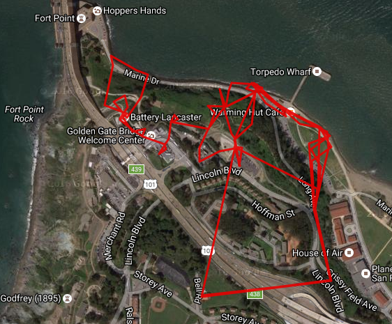

# Simple Bot for Pokemon Go

Built on top of [FeroxRev's Pokemon-Go-Rocket-API](https://github.com/FeroxRev/Pokemon-Go-Rocket-API), which is included as a submodule (so do not forget to do `git submodule init && git submodule update` upon cloning).

This is a simple bot with simple logic - walk around at speeds acheivable by humans, visit pocketops, catch pokemons.

###Features: 
* movemenmt randomization
* delay randomization
* human-like randomized movement speed
* myopic decision-making (walking to the closest pokestop/pokemon first)
* movement log via GPX

###Sample GPX trail for the bot:
(visualized via [GPX visualizer and Google Maps](http://www.gpsvisualizer.com/))

Pier 39 walk:

Another Pier 39 walk - this time it took a different turn:

Golden Gate walkabout:

###Sample console output:
---
'''
u: bxxxxxxxxxxxxxd
p: ********
[13:24:45] You are XxxxxxXxxx; stardust: 30871
[13:25:00]  . Walking towards Checkpoint for 28m in 9s @ 11km/h
[13:25:10] Reached 'Golden Gate Braille'; XP: 50, Gems: 0, Items: 1 x ItemPokeBall, 1 x ItemUltraBall, 1 x ItemPotion
[13:25:10]  . Walking towards Bulbasaur for 35m in 12s @ 10km/h
[13:25:28]  + Bulbasaur: CP 605; P: 0.1248726 [ItemUltraBall]
[13:25:28]  . Walking towards NidoranFemale for 55m in 20s @ 10km/h
[13:25:55]  + NidoranFemale: CP 399; P: 0.343478 [ItemGreatBall]
[13:25:55]  . Walking towards Bulbasaur for 20m in 7s @ 10km/h
[13:25:15]  . Walking towards Zubat for 31m in 12s @ 9km/h
[13:25:34]  + Zubat: CP 365; P: 0.3121815 [ItemGreatBall]
[13:25:34]  . Walking towards Zubat for 32m in 14s @ 8km/h
[13:25:55]  + Zubat: CP 285; P: 0.47944 [ItemPokeBall]
[13:25:55]  . Walking towards Zubat for 62m in 29s @ 8km/h
[13:27:29]  + Zubat: CP 415; P: 0.2829318 [ItemGreatBall]
[13:27:29]  . Walking towards NidoranMale for 24m in 7s @ 13km/h
[13:27:40]  + NidoranMale: CP 227; P: 0.4513577 [ItemPokeBall]
[13:27:40]  . Walking towards Venonat for 12m in 3s @ 13km/h
[13:27:49]  + Venonat: CP 40; P: 1 [ItemPokeBall]
[13:27:49]  . Walking towards Zubat for 46m in 12s @ 14km/h
[13:28:07]  + Zubat: CP 476; P: 0.2780098 [ItemGreatBall]
[13:28:07]  . Walking towards Bulbasaur for 27m in 7s @ 15km/h
[13:28:25]  + Bulbasaur: CP 347; P: 0.2301896 [ItemPokeBall]
[13:28:26] You are XxxxxxXxxx; stardust: 31771
[13:28:36]  > Venonat (CP 40)
[13:28:37]  > Zubat (CP 415)
[13:28:38]  > Zubat (CP 368)
[13:28:39]  > Zubat (CP 365)
[13:28:40]  > Zubat (CP 285)
[13:28:41]  > Bulbasaur (CP 576)
[13:28:42]  > Bulbasaur (CP 347)
[13:28:43]  > NidoranFemale (CP 399)
[13:28:47]  + Evolved Bulbasaur for 500xp
[13:28:51]  + Evolved NidoranFemale for 500xp
[13:28:56]  + Evolved Zubat for 500xp
[13:29:01]  > 1x ItemPotion
[13:29:02]  . Walking towards Checkpoint for 33m in 14s @ 9km/h
[13:29:17] Reached 'Joseph B. Strauss'; XP: 50, Gems: 0, Items: 1 x ItemRazzBerry, 1 x ItemPokeBall, 1 x ItemUltraBall
[13:29:17] You are XxxxxxXxxx; stardust: 31771
[13:29:26]  > Golbat (CP 1446)
[13:29:26]  > Nidorina (CP 935)
[13:29:27]  > Ivysaur (CP 952)
[13:29:33]  . Walking towards Checkpoint for 47m in 16s @ 10km/h
[13:29:50] Reached '1933- 1935 Golden Gate Construction'; XP: 50, Gems: 0, Items: 3 x ItemPokeBall
[13:29:50] You are XxxxxxXxxx; stardust: 31771
[13:30:05]  . Walking towards Checkpoint for 89m in 25s @ 13km/h
[13:30:31] Reached 'The Golden Gate Bridge: Vision'; XP: 50, Gems: 0, Items: 2 x ItemHyperPotion, 1 x ItemPotion
[13:30:31] You are XxxxxxXxxx; stardust: 31771
[13:30:45]  > 1x ItemPotion
[13:30:45]  . Walking towards Checkpoint for 29m in 14s @ 8km/h
[13:31:01] Reached 'Seismic Isolation'; XP: 50, Gems: 0, Items: 1 x ItemRazzBerry, 1 x ItemPokeBall, 1 x ItemGreatBall, 1 x ItemUltraBall
[13:31:01] You are XxxxxxXxxx; stardust: 31771
[13:31:13]  . Walking towards Checkpoint for 51m in 24s @ 8km/h
[13:31:38] Reached 'Lieutenant Fenstermaker Bench'; XP: 50, Gems: 0, Items: 1 x ItemRazzBerry, 1 x ItemSuperPotion, 1 x ItemPokeBall
[13:31:39]  . Walking towards Sandshrew for 50m in 20s @ 9km/h
[13:32:05]  + Sandshrew: CP 475; P: 0.2780098 [ItemGreatBall]
[13:32:05] You are XxxxxxXxxx; stardust: 31871
[13:32:19]  > 1x ItemSuperPotion
[13:32:20]  . Walking towards Checkpoint for 78m in 37s @ 8km/h
'''
---

###Legal

This code is in no way affiliated with, authorized, maintained, sponsored or endorsed by Niantic, The Pokémon Company, Nintendo or any of its affiliates or subsidiaries. 
This project was created for educational and entertainment use ONLY. Use at your own risk.
